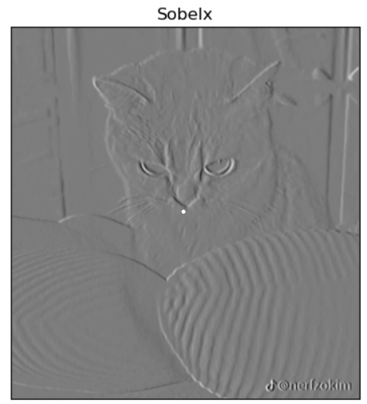
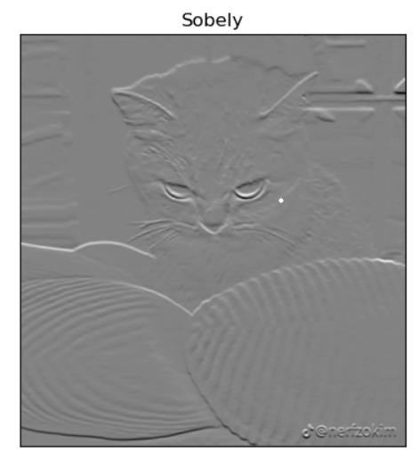
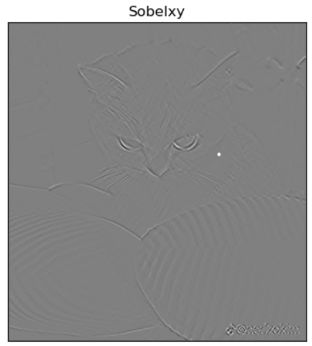
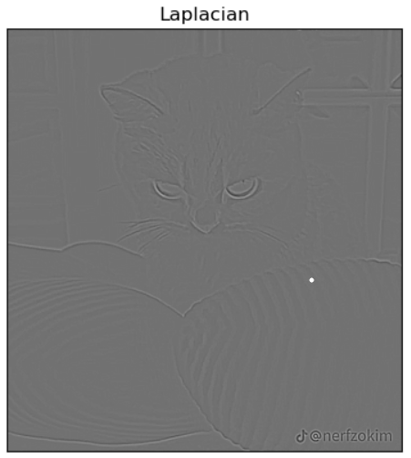
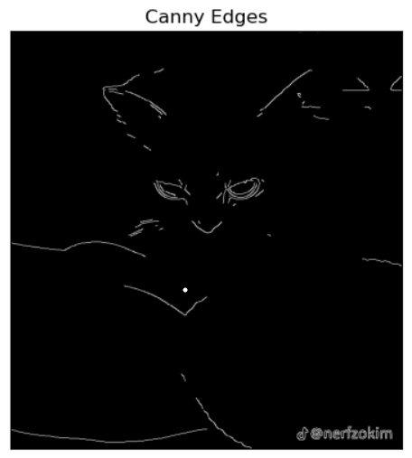

# Edge-Detection
## Aim:
To perform edge detection using Sobel, Laplacian, and Canny edge detectors.

## Software Required:
Anaconda - Python 3.7

## Algorithm:
### Step1:
Import the necessary modules.

### Step2:
Perform edge detection on a image.

1. Sobel
2. Laplacian
3. Canny

### Step3:
Display the original images with edge detected images.

## Program:
# Import the packages
```py
import cv2
import numpy as np
import matplotlib.pyplot as plt 
```

# Load the image, Convert to grayscale and remove noise
```py
pic=cv2.imread('meme.webp')
cv2.imshow('Original',pic)

togray = cv2.cvtColor(pic,cv2.COLOR_BGR2GRAY)
cv2.imshow('BGR To HSV',togray)

img=cv2.GaussianBlur(togray,(3,3),0)
cv2.imshow('Gaussian Blur',img)

cv2.waitKey(0)
cv2.destroyAllWindows()
```

# SOBEL EDGE DETECTOR
```py
sobelx=cv2.Sobel(img,cv2.CV_64F,1,0,ksize=5)
plt.figure(1)
plt.imshow(sobelx,cmap='gray')
plt.title('Sobelx'),plt.xticks([]),plt.yticks([])
plt.show()

sobely=cv2.Sobel(img,cv2.CV_64F,0,1,ksize=5)
plt.figure(1)
plt.imshow(sobely,cmap='gray')
plt.title('Sobely'),plt.xticks([]),plt.yticks([])
plt.show()

sobelxy=cv2.Sobel(img,cv2.CV_64F,1,1,ksize=5)
plt.figure(1)
plt.imshow(sobelxy,cmap='gray')
plt.title('Sobelxy'),plt.xticks([]),plt.yticks([])
plt.show()
```

# LAPLACIAN EDGE DETECTOR
```py
laplacian=cv2.Laplacian(img,cv2.CV_64F)
plt.figure(1)
plt.imshow(laplacian,cmap='gray')
plt.title('Laplacian'),plt.xticks([]),plt.yticks([])
plt.show()
```
# CANNY EDGE DETECTOR
```py
canny_edges=cv2.Canny(img,120,150)
plt.figure(1)
plt.imshow(canny_edges,cmap='gray')
plt.title('Canny Edges'),plt.xticks([]),plt.yticks([])
plt.show()
```

## Output:
### Original image and Converted image


### SOBEL EDGE DETECTOR



### LAPLACIAN EDGE DETECTOR

### CANNY EDGE DETECTOR

## Result:
Thus the edges are detected using Sobel, Laplacian, and Canny edge detectors.
